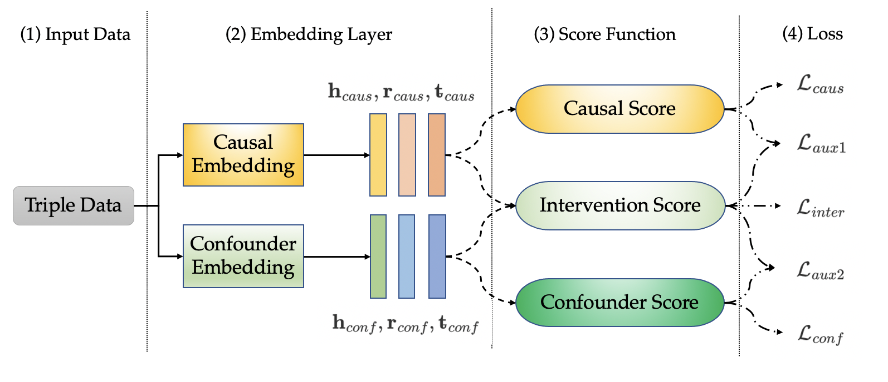

# CausE: Towards Causal Knowledge Graph Embedding

[](https://github.com/zjukg/CausE/main/LICENSE)
[](https://sigkg.cn/ccks2023/)
[](https://pytorch.org/)
 - [*CausE: Towards Causal Knowledge Graph Embedding*](https://arxiv.org/abs/2307.11610)

> Knowledge graph embedding (KGE) focuses on representing the entities and relations of a knowledge graph (KG) into the continuous vector spaces, which can be employed to predict the missing triples to achieve knowledge graph completion (KGC). However, KGE models often only briefly learn structural correlations of triple data and embeddings would be misled by the trivial patterns and noisy links in real-world KGs. To address this issue, we build the new paradigm of KGE in the context of causality and embedding disentanglement. We further propose a Causality-enhanced knowledge graph Embedding (CausE) framework. CausE employs causal intervention to estimate the causal effect of the confounder embeddings and design new training objectives to make stable predictions. Experimental results demonstrate that CausE could outperform the baseline models and achieve state-of-the-art KGC performance.

## 🌈 Model Architecture


## 📕 Code Path

#### Code Structures
There are three parts in the code.
- **openke**: It contains the main files for CausE.
- **benchmarks**: It contains the data splits for different datasets.
- **script**: The training scripts for CausE.

## 🔬 Dependencies

- ```Python 3```
- ```PyTorch >= 1.8.0```
- ```NumPy```
- All experiments are performed with one RTX 3090Ti GPU.

## 📚 Prerequisites
- **Dataset**: The baseline datasets FB15K-237 and WN18RR have been prepared in the `benchmarks/`, you can also upload your own KG datasets in the same form.
- **Environment**: Our code is based on the open-source project [OpenKE](https://github.com/thunlp/OpenKE), you need to following up the instruction in the OpenKE to build the running environment.

## 🚀 Train & Eval

The training script for **CausE**:
```shell
bash script/run_cause_transe.sh # TransE score function
bash script/run_cause_distmult.sh # DistMult score function
bash script/run_cause_complex.sh # ComplEx score function
```

The default hyper-parameters are set in the scripts. You can carefully tune these parameters

## 🤝 Cite:
Please condiser citing this paper if you use the code from our work.
Thanks a lot :)

```bigquery
@misc{zhang2023cause,
      title={CausE: Towards Causal Knowledge Graph Embedding}, 
      author={Yichi Zhang and Wen Zhang},
      year={2023},
      eprint={2307.11610},
      archivePrefix={arXiv},
      primaryClass={cs.CL}
}
```
